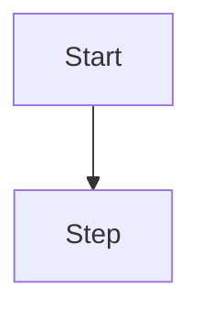

# Blog authoring cheat sheet (LLM-friendly)

Use this as a short prompt to produce publishable markdown files in `blogs/` that the build pipeline converts into HTML via the generator in `scripts/generate-blogs.js`.

## File rules
- Location: `blogs/<slug>.md`.
- Encoding: UTF-8, plain Markdown.
- Frontmatter: YAML between `---` fences at top of file (no trailing commas).
- Slug: use `slug` in frontmatter; if omitted, the filename (without `.md`) becomes the slug.
- Dates: ISO 8601 string (e.g., `2025-01-15T12:00:00Z`).
- Tags: array of short strings (e.g., `['react', 'diagrams']`).
- Image: absolute path to a public asset (e.g., `/blog-images/my-diagram.png` in `public/blog-images/`). Leave blank if none.

## Supported content
- Standard Markdown headings, lists, tables, blockquotes.
- Code fences with language hints for syntax highlighting (e.g., ```js). Unknown languages auto-highlight.
- Mermaid diagrams: wrap graph text in ```mermaid fences; the generator preserves them for client-side rendering.
- Links and images use standard Markdown; prefer root-relative image paths.

## Minimal template to ask an LLM to fill
```markdown
---
title: "<concise title>"
date: "<ISO date>"
slug: "<kebab-case-slug>"
description: "<150-char summary>"
tags: ["tag-one", "tag-two"]
image: "/blog-images/<optional-image>.png"
---

# <Human-readable heading>

Intro paragraph that states the goal and why it matters.

## Problem
- What is being solved.
- Context or constraints.

## Approach
1. Key steps (bullet or numbered).
2. Include code if helpful:
```js
// brief snippet
```

## Diagram (optional)


## Takeaways
- Three to five crisp bullets.
```

Keep language concise and avoid filler so the generator produces clean HTML.
