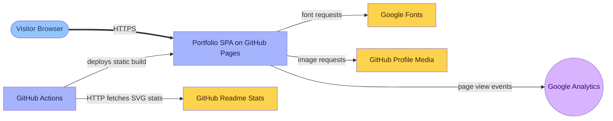

# cjlludwig.github.io


## Description

`cjlludwig.github.io` is a React and Vite portfolio website for Connor Ludwig. It publishes a responsive personal site with resume-driven content, a technical blog, SEO metadata, structured data, dark mode, generated social images, and GitHub Pages deployment automation.

The site uses `resume.md` and Markdown files in `blogs/` as source content, then generates React-consumable data and static blog pages during the build.

## Getting Started

### Dependencies

- `Node.js ^22.0.0`
- `Pandoc` (optional) — required to regenerate `public/resume.pdf`
- `XeLaTeX` (optional) — required by the `generate-resume-pdf` script through `--pdf-engine=xelatex`

### Installation

1. Install dependencies.

```shell
npm ci
```

2. Run first-time asset and resume generation.

```shell
npm run setup
```

3. Start the development server — see [Development Commands](#development-commands).

### Development Commands

```shell
npm run dev                  # parse resume, normalize blogs, cache GitHub stats, and start Vite
npm run build                # generate data, build with Vite, prerender blog pages, and generate sitemap
npm test                     # run the production build validation path
npm run validate             # run build and print a push-safe validation confirmation
npm run preview              # preview the production build locally
npm run deploy               # build and deploy dist/ to GitHub Pages with gh-pages
npm run setup                # generate favicons, social images, resume JSON, and resume PDF when tools exist
npm run parse-resume         # parse resume.md into src/data/resume-data.json
npm run generate-resume      # parse resume.md and attempt PDF generation
npm run generate-resume-pdf  # generate public/resume.pdf from resume.md with Pandoc and XeLaTeX
npm run generate-blogs       # compile blogs/*.md into src/data/blogs.json
npm run fix-blogs            # add inferred frontmatter to blog Markdown files that lack it
npm run generate-sitemap     # generate dist/sitemap-pages.xml
npm run generate-icons       # generate favicons and social sharing images
npm run cache-github-stats   # cache GitHub stats SVGs under public/images/github/
npm run spell:warn           # run cspell in non-blocking warning mode
npm run spell:fix            # run cspell with normal exit behavior for spelling review
```

## Usage

**Web**

```shell
# Home page
open http://localhost:5173/

# Blog index
open http://localhost:5173/blog/

# Example blog post route format
open http://localhost:5173/blog/<post-slug>/

# Downloadable resume asset
open http://localhost:5173/resume.pdf
```

The deployed site is configured for `https://cjlludwig.github.io/`. Production builds include prerendered blog pages, canonical metadata, Open Graph and Twitter card metadata, structured data, Google Analytics in production mode, and `sitemap-pages.xml`.

**Content updates**

```shell
# Update resume-backed sections such as personal info, experience, projects, skills, certifications, and education
vim resume.md

# Regenerate resume data after editing resume.md
npm run parse-resume

# Add or update blog posts
vim blogs/example-post.md

# Regenerate blog data after editing blogs/*.md
npm run generate-blogs
```

Blog posts are Markdown files in `blogs/`. The build pipeline converts them to `src/data/blogs.json`, renders syntax-highlighted code blocks with `shiki`, validates Mermaid flowchart directions, supports build-time `figure` blocks, and generates static HTML pages for SEO.

## Architecture

This repository ships a static React portfolio to GitHub Pages, with a small CI build path and browser-side external services for fonts, profile media, and analytics.



## References

- [React](https://react.dev/)
- [Vite](https://vite.dev/)
- [GitHub Pages](https://pages.github.com/)
- [GitHub Actions](https://docs.github.com/actions)
- [gh-pages](https://www.npmjs.com/package/gh-pages)
- [Marked](https://marked.js.org/)
- [gray-matter](https://github.com/jonschlinkert/gray-matter)
- [Shiki](https://shiki.style/)
- [Mermaid](https://mermaid.js.org/)
- [Sharp](https://sharp.pixelplumbing.com/)
- [cspell](https://cspell.org/)
- [Pandoc](https://pandoc.org/)
- [Google Analytics](https://developers.google.com/analytics)

## Help

- **PDF generation skipped**: `npm run generate-resume-pdf` requires `pandoc` and a `xelatex` provider. Install them locally if `public/resume.pdf` needs to be regenerated; otherwise the script prints a warning and continues.
- **Resume changes not reflected**: Run `npm run parse-resume` after editing `resume.md`, or use `npm run dev` / `npm run build`, which regenerate resume data automatically.
- **Blog changes not reflected**: Run `npm run generate-blogs` after editing files under `blogs/`. Use `npm run fix-blogs` if a blog file is missing frontmatter.
- **Mermaid build failure**: Mermaid `flowchart` or `graph` blocks must include a direction such as `TD`, `LR`, `RL`, or `BT`.
- **GitHub stats unavailable**: `npm run cache-github-stats` fetches SVGs from `github-readme-stats.vercel.app`. If the request fails, existing cached files are reused when present.
- **Production-only analytics**: Google Analytics initializes only when `import.meta.env.PROD` is true, so local development does not send analytics events.

