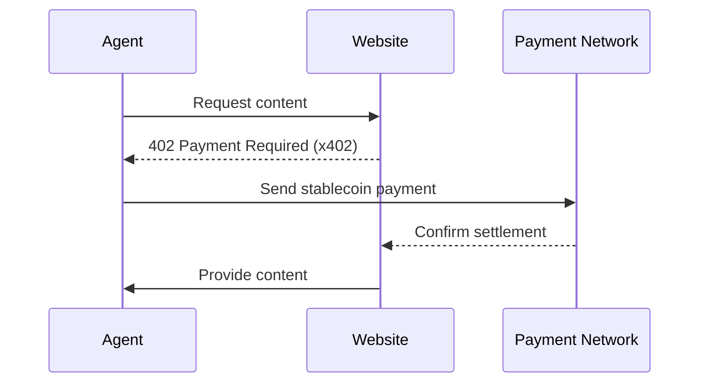

# Agents for Financial Services: Innovation Keynote Recap

A session focused on how agents are reshaping financial services, framed through two perspectives: Allianz’s view on crisis resilience and Coinbase’s view on the missing payments layer limiting agent autonomy. The talk began with a heavy dose of AWS self-praise and big-customer name drops before shifting into more substantive insights from both speakers.

## Allianz CTO: Tech as Catalyst and Resiliency Tool

The Allianz CTO opened by observing that crises—economic, environmental, geopolitical—are becoming more *prevalent* and *more complex*. His central question:

> Is technology accelerating crises, or enabling resilience?

He drew parallels to past architectural shifts:
- Monolith → microservices  
- On-prem → cloud  
- Centralized → distributed services  

Each brought major benefits but also downsides that matched their scale. He warned that agentic systems will likely follow the same pattern: immense advantages paired with equally large risks and unintended consequences. As agents take on more decision-making and operational responsibility, financial institutions will need to prepare for new forms of brittleness and regulatory complexity.

## Coinbase Engineering Leader: The Internet Grew on Standards—Except for Payments

The talk shifted to the **Head of Engineering for the Developer Platform at Coinbase**, who reframed the agent conversation through the lens of infrastructure.

He opened by highlighting how the internet’s explosive growth came from *alignment on shared standards*: HTML, JavaScript, AJAX, and other predictable layers that made it possible for developers to build on one another’s work.

But then he contrasted that with the long-standing gap:

- **Payments never received a global internet-native standard.**
- Every purchase flow today requires friction: multi-field forms, redirects, fragile token flows, CAPTCHAs, and human verification steps.
- This forces humans—not protocols—to be the trust anchor of online transactions.

### Why This Limits Agents
- Agents struggle with brittle, multi-step flows that depend on deterministic inputs.
- Users repeat the same 15+ fields across the entire internet simply because the ecosystem never standardized payments.
- This repetition is exactly the type of task agents perform poorly, which directly contributes to **lack of trust** in autonomous systems.
- The absence of a payment protocol prevents agents from safely or reliably transacting on behalf of users.

The speaker argued that this missing standard is now a core blocker for meaningful agentic capability.

## Introducing x402: A Standard for Machine-to-Machine Payments

Coinbase’s proposed solution is **x402**, an open protocol derived from the abandoned HTTP 402 “Payment Required” status code. It is designed to create a web-native payment handshake usable by both browsers and agents.

### What x402 Attempts to Solve
- Enable agents to autonomously pay for content or service access.
- Remove the need for JWTs, OAuth flows, cookies, or human-entered credentials.
- Provide a predictable, lightweight mechanism for stablecoin-backed payments.
- Close the trust gap between “agent attempts to act” and “agent successfully completes a transaction.”

The protocol is open-sourced by Coinbase and intended to interoperate with agent frameworks, including support libraries for AWS Bedrock agent tooling.

## Demo: Claude Purchases Content Automatically

The demo illustrated how x402 works in practice:
- A Claude session attempted to access paywalled content.
- The website returned a 402 response with x402 metadata.
- Claude executed a stablecoin payment with no stored secrets or user intervention.
- The content was delivered immediately after settlement.

No login flows, auth redirects, cookies, or access tokens—just a machine paying another machine.

## Diagram

## Monetization: Agents Don’t See Ads

A key insight surfaced late in the talk:

Agents do not consume ads.

If agents become the dominant readers of content—summaries, lookups, knowledge extraction—the ad-based monetization model collapses for that traffic. Websites cannot rely on impressions or affiliate funnels with non-human consumers.

The speaker argued that:
 - Ads are ineffective for agents.
 - Traditional paywalls break agent workflows.
 - Direct, protocol-level payments may become the only viable way to avoid large-scale abuse and support content creators in an agent-driven ecosystem.

x402 is positioned as a foundation for that shift.

## Takeaways
 - Crisis complexity is increasing, and agent systems will carry proportional benefits and downsides.
 - The internet’s explosive growth came from shared standards; payments remain a conspicuous exception.
 - Missing payment primitives directly limit agent autonomy and trust.
 - x402 proposes a lightweight, open, stablecoin-backed protocol for machine-to-machine payments.
 - Monetization for an agent-read web will likely hinge on direct per-request payments, not ads.

## Resources
 - https://github.com/coinbase/x402
 - https://developer.mozilla.org/en-US/docs/Web/HTTP/Status/402
 - https://developers.coinbase.com/
 - https://reinvent.awsevents.com/
 - https://www.allianz.com/en/press/

