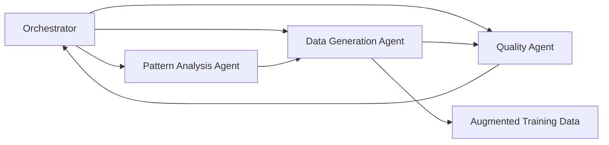

# Automated LLM Fine-Tuning with Multi-Agent Systems

## TLDR
- AWS showcased an internal multi-agent architecture used to automate and speed up LLM fine-tuning.
- Three specialized agents — pattern analysis, data generation, and quality — work in a controlled loop.
- The approach addresses capability gaps in small models without exploding compute costs.
- Workflow efficiencies came from batching, sub-sampling, and clustering error patterns.
- Gains were incremental but consistent, highlighting that data quality — not model size — drives tuning success.
- Useful conceptual blueprint, even though no turn-key AWS product exists yet.

This session from AWS’s Generative AI Innovation Center explored how they accelerate fine-tuning using a structured multi-agent workflow. While not something customers can download today, the architecture provided a clear lens into real-world tuning pipelines and how teams can automate data generation at scale.

## The Tradeoff Landscape: Accuracy, Cost, and Latency

AWS framed model optimization as a balancing act across three levers:

- **Accuracy**
- **Cost**
- **Latency**

Improving one often regresses another, so every tuning project must prioritize based on business needs. The system showcased in this talk aims to make these tradeoffs explicit and controllable.

## Why Small Models Are Back in Style

A key theme: the growing shift toward **small, domain-targeted models**.

**Upsides**
- Lower compute requirements
- Faster inference
- Significantly cheaper to run in production

**Downsides**
- Limited generalization due to fewer parameters
- More brittle behavior in unfamiliar scenarios
- Partially “blind spots” requiring augmentation

This creates pressure to fill capability gaps efficiently — which is where structured multi-agent data generation comes in.

## The Customization Spectrum

AWS positioned fine-tuning as one option among several ways to customize model behavior. Ordered by effort and potential impact:

1. Prompt engineering  
2. Retrieval-augmented generation (RAG)  
3. Fine-tuning and distillation  
4. Reinforcement learning approaches (DPO/GRPO)  
5. Mid-training or pre-training

The message: **most organizations can get farther than they realize by improving fine-tuning data quality**, not necessarily by redesigning models.

## The True Cost Curve: Training vs. Inference

One of the session’s more useful visuals contrasted:

- High **upfront training/customization cost**
- Long-tail **inference cost**, which dominates total spend

This is especially relevant for small models: a little tuning up front dramatically reduces ongoing inference footprint. That’s why AWS invests in data automation — tuning must be cheap enough to justify frequent iterations.

## Multi-Agent Architecture: A Hybrid Orchestration Model

AWS’s proposed architecture combines lightweight rule-based logic with LLM-driven decision making. A central orchestrator coordinates three specialized agents. The orchestrator manages routing, task breakdown, quality loops, and termination conditions, keeping each agent tightly scoped to reduce hallucination risk and produce more interpretable outputs.

## Pattern Analysis: Finding What the Model Doesn’t Understand

The **Pattern Analysis Agent** identifies weaknesses in the model by analyzing failure cases.

Two strategies were evaluated:

1. **Direct error sampling** – collect incorrect outputs and feed them as examples  
2. **Error pattern generalization** – cluster mistakes into conceptual categories

The first approach caused overfitting: the model learned artifacts of the error samples themselves.

The generalized strategy avoided this, enabling the agent to surface conceptual gaps (e.g., reasoning steps the model skips) and provide structured guidance to the generator agent.

## Data Generation: Producing New Training Samples at Scale

The **Data Generation Agent** creates training samples driven by:

- gap patterns identified earlier  
- task-specific context  
- orchestrator constraints

In the demo example (a code snippet for a mean deviation function), the generator produced a technically correct but unreadable solution. The moment underscored the value of the next step — external quality judgment.

## Quality Agent: A Neutral Judge to Reduce Bias

The **Quality Agent** evaluates outputs using a *different* model than the generator. This separation helps:

- reduce shared biases
- enforce correctness and clarity
- mitigate hallucination
- ensure alignment with the intended task

The agent provides structured feedback to the orchestrator, which decides whether to accept or regenerate samples.

## Efficiency Wins in Their Production Setup

AWS improved throughput and cost efficiency using:

- **Batching** multiple inputs per generation round  
- **Sub-sampling** to shorten context windows  
- **Error pattern clustering** to reduce the total number of model invocations  
- **Parallel execution** of sub-agents when possible  

These optimizations made the pipeline fast and affordable enough for repeated, iterative tuning.

## Benchmarks and Real-World Gains

The benchmark slides showed consistent but modest improvements across accuracy metrics compared to traditional fine-tuning. While not dramatic, the gains reinforce a reality across the industry: **automation improves consistency and reduces cost**, even if the absolute accuracy lift is incremental.

## Closing Thoughts

This session shared a pragmatic multi-agent blueprint rather than announcing a product. It illustrated a repeatable way to:

- reduce data-prep friction  
- identify model blind spots  
- generate structured training samples  
- incorporate independent quality checks  
- upgrade small models without scaling compute budgets

Ultimately, it reinforces the theme that **fine-tuning success depends more on data quality than raw model size**.

## Further Reading & Resources

- AWS Generative AI Innovation Center  
  https://aws.amazon.com/generative-ai/innovation-center/

- *Custom Intelligence: Multi-Agent Data Augmentation for LLMs*  
  https://arxiv.org/abs/2510.18143

- Hugging Face: Fine-Tuning Overview  
  https://huggingface.co/docs/transformers/main/en/training
