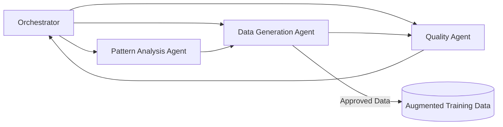

# TLDR
- AWS demoed a multi-agent system used internally to automate and accelerate LLM fine-tuning.  
- Three specialized agents — pattern analysis, data generation, and quality — work in a feedback loop orchestrated by a controller.  
- The goal: reduce data-prep friction, improve accuracy, and make small models more practical for production.  
- The talk emphasized the tradeoffs: accuracy vs cost vs latency, and why small models need augmentation workflows to close capability gaps.  
- Results showed incremental but consistent performance gains, with clearer operational efficiency.  
- Useful conceptual overview, not a packaged AWS product — but plenty of patterns worth borrowing.

---

# Automated LLM Fine-Tuning With Multi-Agent Systems  
### Notes from *Custom Intelligence: Building AI That Matches Your Business DNA* (AWS Generative AI Innovation Center)

This session walked through how AWS internally speeds up LLM fine-tuning using a hybrid multi-agent architecture. Nothing “off-the-shelf” for customers yet — but a surprisingly transparent peek at how they run production-grade fine-tuning loops at scale.

The core idea: **fine-tuning isn’t compute-bound, it’s data-prep-bound**. And the biggest wins come from automating the boring parts.

---

## Why Even Fine-Tune?
AWS broke tuning tradeoffs into three buckets:

- **Accuracy**  
- **Latency**  
- **Cost**

Pulling one lever affects the others. Raising accuracy might inflate inference cost; optimizing latency might require pruning parameters. Every tuning effort ultimately needs a business-aligned prioritization.

---

## The Shift Toward Small Models
A major theme: **the industry is drifting to smaller models**, not because they’re more capable but because they’re *just capable enough* for a given task.

Benefits of small models:
- Lower compute footprint  
- Faster inference  
- Friendlier cost profile  

Drawbacks:
- Narrower generalization  
- Weaker reasoning  
- Model “holes” that show up more often  

So how do you patch those holes without ballooning cost?  
This is where AWS positions its multi-agent workflow.

---

## A Quick Tour Through Customization Options
The slides laid out a spectrum of customization techniques, roughly ranked by effort and payoff:

1. **Prompt engineering** – lowest friction, lowest impact  
2. **RAG** – adds factual grounding  
3. **Fine-tuning & distillation** – targeted improvement where it counts  
4. **Reinforcement learning (DPO/GRPO)** – tighter alignment  
5. **Pre-training / mid-training** – heavy lift, highest impact

Their thesis: most businesses underestimate *how far* they can get with targeted fine-tuning and a well-designed data pipeline.

---

## The Real Cost Story: TCO of LLMs
One slide charted TCO over a model’s lifecycle:

- **Model customization** has a burst of upfront cost  
- **Inference dominates long-term cost**  
- Smaller customized models tend to win over time because inference is so much cheaper

This set the stage for why AWS built automation around turning raw errors into higher-quality training data: it helps small models punch above their weight.

---

# Multi-Agent Architecture for Automated Fine-Tuning

AWS proposed (and demoed) a three-agent pipeline orchestrated by a controller model. A mix of rules and LLM-driven decisions keeps the workflow predictable but flexible.

Here’s a conceptual view:

---

## Agent 1: Pattern Analysis  
This agent identifies *where* the model is failing and *why*.

Two approaches were tested:

1. **Error sampling** – collect incorrect model outputs and feed them directly to the data generator  
2. **Generalized error patterns** – cluster mistakes into conceptual buckets and generate prompts around those themes  

The first version caused over-fitting: the model learned to mimic patterns in the error samples themselves.

The second approach — clustering into error patterns — generalizes better and reduces hallucination risk while still guiding data generation.

---

## Agent 2: Data Generation  
This agent is responsible for synthesizing new training samples.

It consumes:
- guidance from the pattern analysis agent  
- constraints provided by the orchestrator  
- the target domain task (e.g., generating better code answers)

The talk highlighted a live example where the generator wrote a correct but hilariously unreadable implementation of a mean deviation function — which the quality agent later flagged.

The key is that this agent isn't blindly producing data; its prompts are enriched with the *strategic gap analysis* from Agent 1.

---

## Agent 3: Quality  
A judge model — intentionally a *different* model to reduce shared biases.

It evaluates:
- relevance  
- instruction adherence  
- usefulness  
- hallucination signals  

Its feedback feeds back into the orchestrator, which may regenerate samples or approve them for inclusion.

This cross-model judging step was one of the most important mitigations AWS emphasized.

---

# Efficiency Tricks From Their Production Setup
AWS shared several optimizations that materially improved throughput:

- **Batching multiple data inputs** per agent call  
- **Sub-sampling** to shrink context windows and reduce token usage  
- **Pattern clustering** to reduce the total number of model invocations  
- **Parallelization via sub-agents** for speed and cost efficiency  

Taken together, these tweaks reduced both run time and dollar cost for large augmentation runs.

---

# How Well Does It Work?
The benchmark slides showed small but consistent improvements across accuracy metrics when comparing:

**traditional fine-tuning** vs. **multi-agent-driven fine-tuning**

The deltas weren’t enormous, but they aligned with broader industry data:  
most fine-tuning gains are incremental, and the magic comes from better *data*, not bigger *models*.

---

# My Takeaways
- AWS isn’t shipping a product here; it’s showing a **blueprint** for how they automate data pipelines internally.  
- The biggest value is conceptual: how to structure specialized agents so each one adds clarity, not chaos.  
- For teams adopting small models, this workflow helps compensate for capability gaps without escalating compute cost.  
- The session also doubled as a gentle reminder: **the quality of your data pipeline determines the ceiling of your fine-tuning.**

---

# Further Reading & Resources
- AWS session listing — *Custom Intelligence: Building AI That Matches Your Business DNA* (re:Invent)  
- AWS Generative AI Innovation Center: https://aws.amazon.com/generative-ai/innovation-center/  
- Paper referenced in talk: https://arxiv.org/abs/2510.18143  
- Background on SFT, DPO, fine-tuning:  
  - https://huggingface.co/docs/transformers/main/en/training  
  - https://www.anthropic.com/research/dpo

