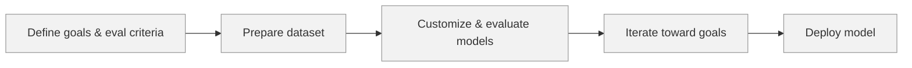

# Customizing Foundation Models with SageMaker AI

## TLDR
- SageMaker AI now offers guided, serverless model customization workflows with fine-tuning, RL, and synthetic data options.
- The console experience is polished, but code-first parity may lag.
- Customization improves latency, cost, and accuracy.
- Evaluation, lineage, and benchmark comparison are built in.
- Private VPC, encryption, and governance are available by default.

AWS is leaning heavily into making model customization accessible to teams that don’t want to spend months wrangling GPU clusters, custom trainers, and eval pipelines. This session walked through a new SageMaker AI workflow designed to reduce customization time from months to roughly 30 minutes. Below are my refined notes and interpretations from the talk and live demo.

## The Model Customization Workflow

The core workflow: define goals → gather data → customize → iterate → deploy.  
All of it sits under a governance and responsible-AI framework.

## Why Customize When Foundation Models Keep Getting Better?

The presenter emphasized three motivations:

1. **Latency** — Smaller or domain-specific models respond faster.  
2. **Cost** — Fine-tuned models often use fewer tokens and smaller architectures.  
3. **Accuracy** — Domain-adapted reasoning reduces hallucinations and improves reliability.

In short: tuning transforms the model into a domain-expert instead of a generalist.

## New Console Flows in SageMaker AI

The new “Customize” dropdown appears on all supported foundation models in the SageMaker AI console.

Highlights:

### Kiro-Enabled Spec Process
A guided wizard that dynamically validates configuration choices and prevents invalid setups.

### Customization Techniques
Multiple tuning modes were demonstrated:

- Supervised fine-tuning  
- RLVR  
- Reinforcement Learning  
- RL with LLM-as-a-judge  

The last option is notable: AWS now provides judge models natively for reinforcement learning loops.

### Synthetic Data Generation
Users can generate synthetic examples either:

- without supplying data (pure synthetic),  
- with an input bucket for grounding, or  
- with fully user-defined datasets.

### Evaluator Page
A built-in interface for creating or importing eval sets.  
AWS includes a catalog of predefined training scenarios, such as high-quality tool-calling evaluations.

This solves one of the historically painful parts of model customization: the eval pipeline.

## Live Demo: SageMaker Studio

The presenters demonstrated the full workflow:

- Selecting a base model  
- Triggering customization  
- Creating synthetic examples  
- Reviewing evaluation criteria  
- Tuning for tool-calling quality  
- Comparing base vs. tuned outputs  
- Testing in the prompt playground  
- Deploying to an endpoint  

The key message: a process that used to take months can now be run serverlessly in ~30 minutes.

A caveat: although the speaker said everything is supported “as code,” AWS launches often lag in full IaC coverage. Code-first teams may find gaps on day one.

### Diagram

## Infrastructure & Security Notes

AWS emphasized secure defaults:

- Serverless runtime  
- Private VPC support  
- Automatic volume encryption  
- Lineage tracking for every step  

Governance is woven throughout the lifecycle rather than added as an afterthought.

## Benchmarking & Comparison

After customization completes:

- Users can benchmark the base vs. tuned model using AWS or custom eval suites.  
- Side-by-side comparisons are available.  
- Lineage, parameters, and history are fully traceable.

## Prompt Playground & Deployment

Teams can immediately:

- adjust inference parameters,  
- test prompts interactively,  
- deploy the model to an endpoint, and  
- manage endpoints in the UI.

This closes the loop from idea to production in a single interface.

## Useful Reference
**Foundation models and hyperparameters for fine-tuning — Amazon SageMaker AI**  
https://docs.aws.amazon.com/sagemaker/latest/dg/jumpstart-foundation-models-fine-tuning.html

## Further Reading / Resources
- AWS SageMaker AI documentation: https://docs.aws.amazon.com/sagemaker/latest/dg/whatis.html  
- SageMaker JumpStart foundation models: https://aws.amazon.com/sagemaker/jumpstart/  
- AWS ML Blog (tuning techniques, RLHF, RLVR): https://aws.amazon.com/blogs/machine-learning/  
- AWS Responsible AI pages: https://aws.amazon.com/responsible-ai/  
- re:Invent session portal (slides when posted): https://reinvent.awsevents.com/