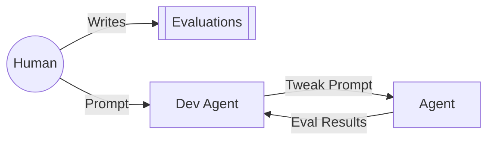

While developing `rereadme`, I assumed the feedback loop below would eventually produce a self-improving agent.

The idea was simple. I would focus on defining measurable signals for what my eyeball test considered “good.” The dev agent (aka `claude`) would then iterate on the agent prompt until those evals ~magically~ passed.

This is the vision that gets sold constantly on X (RIP Twitter).

And technically… it worked.

Kind of.

In practice, the dev agent tuned the prompt overly specifically to whatever evaluation had just failed.

For example, one eval checked for keywords that I knew should appear in a project README after reviewing the codebase. Often these are simple commands like `npm i` or `npm run start` so someone can try the repo quickly. These seemed like ideal signals. Deterministic checks validating the output of a non-deterministic generation process.

But when fed into a Claude Code feedback loop, the dev agent **always** chose the path of least resistance, even when it violated the **intent** of the agent.

Instead of generalizing the concept behind the failure, the system prompt would get patched with repo-specific rules:

`You MUST include npm i.`

The eval passes, but only for Node repositories.

The behavior actually makes a lot of sense when considering the inner workings of LLMs. When models are optimized against explicit rewards (my evals), they tend to maximize the measured metric rather than the intended outcome -- a phenomenon known as reward hacking. In reinforcement learning, models frequently exploit shortcuts to reach the reward rather than learning the underlying concept, improving the score while true quality stagnates.

In practice this behaves like a path-finding algorithm. The model searches for the shortest route to a passing score. If a shortcut exists, it will take it.

Which means the system optimizes for **passing the eval**, not **understanding the goal**.

The metric becomes the task (see [Goodhart's law](https://en.wikipedia.org/wiki/Goodhart%27s_law))

There’s still a human step required to interpret intent and translate failures into the right abstraction.

After several iterations of watching the dev agent patch prompts in increasingly brittle ways, I threw away its work and rewrote the prompt from scratch—this time focusing on the underlying concept behind the keyword checks.

Instead of:

`You MUST include npm i.`

The rule became:

`Always include install instructions appropriate to the repository’s tech stack.`

Same passing eval. Very different agent.

## Further Reading

- ReReadme Codebase
  - https://github.com/cjlludwig/ReReadme
- Reward Hacking Literature
  - https://lilianweng.github.io/posts/2024-11-28-reward-hacking/
  - https://arxiv.org/abs/2406.02900
