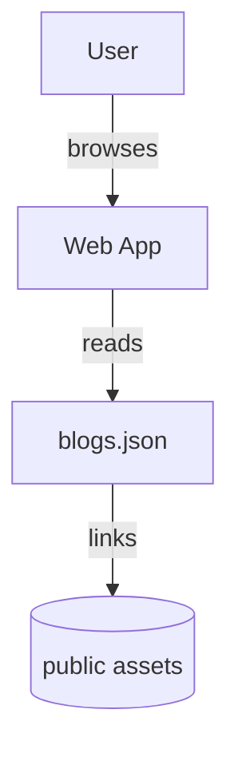
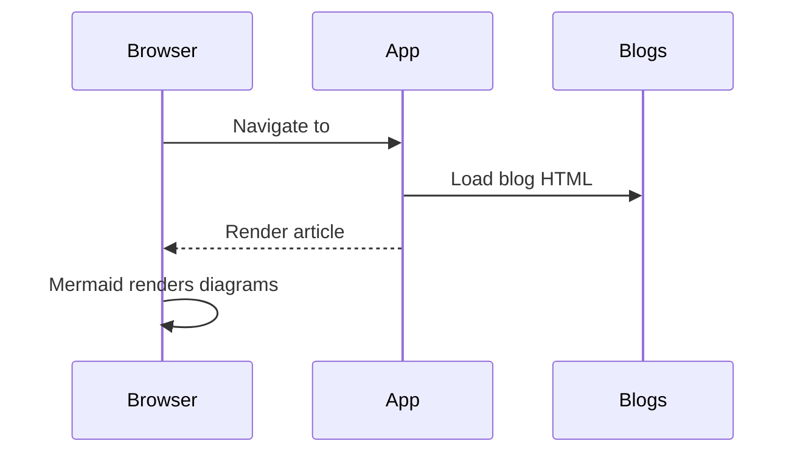

Modern docs benefit from visual explanations. Here's a simple architecture sketch:

```mermaid
graph TD
  User[User] -->|browses| WebApp[Web App]
  WebApp -->|reads| BlogData[blogs.json]
  BlogData -->|links| Images[(public assets)]
```

And here's a sequence diagram for a request lifecycle:

```mermaid
sequenceDiagram
  participant Browser
  participant App
  participant Blogs
  Browser->>App: Navigate to #/blog/mermaid-demo
  App->>Blogs: Load blog HTML
  App-->>Browser: Render article
  Browser->>Browser: Mermaid renders diagrams
```
